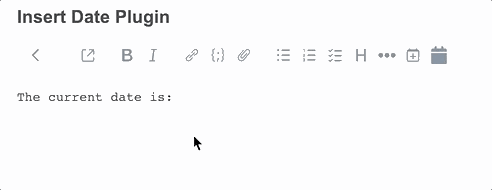

# Joplin Insert Date Plugin

`joplin-insert-date` plugin adds a button to the editor toolbar that, when pressed, inserts the current date into the editor.

## Download

- Navigate to the [releases](https://github.com/herdsothom/joplin-insert-date/releases) page and download the latest `joplin-insert-date.jpl` file.
- In Joplin, navigate to `Preferences` -> `Plugins` and click the gear icon.
- Select `Install from file`, then select the `joplin-insert-date.jpl` file you downloaded.

